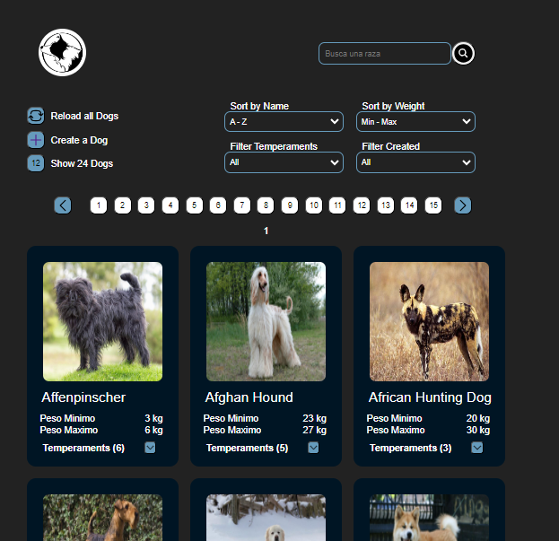
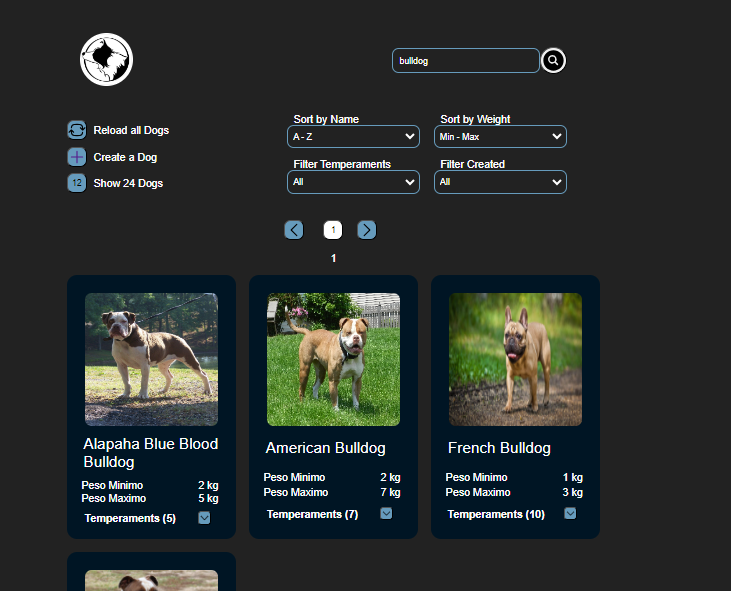
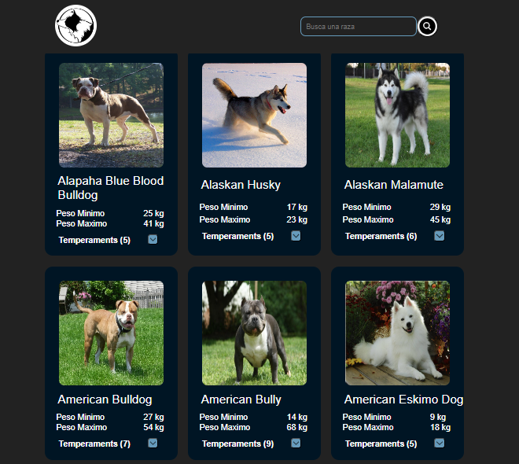
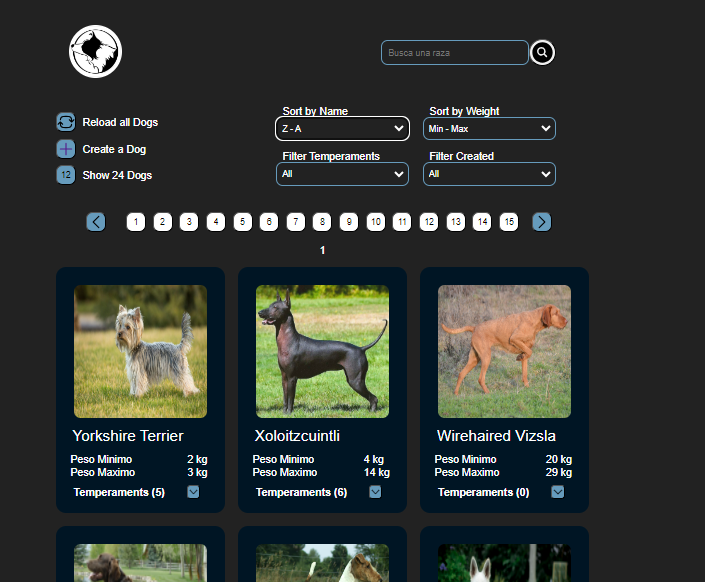
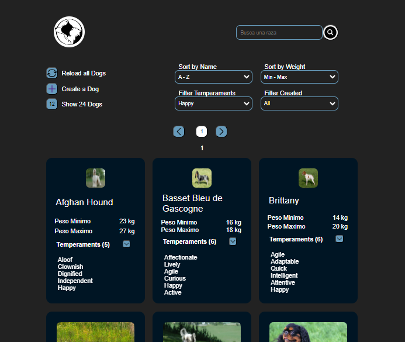
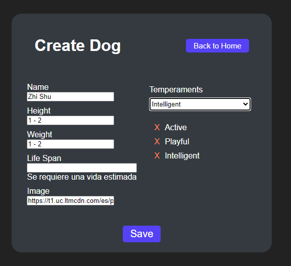

<h1 align="center">Hi 👋, I'm Tomas</h1>

<b>Welcome to my GitHub page !! </b> 
My name is Tomas Ferro and ...  
👉 I'm a Full stack developer, specialized in Node JS and JavaScript  
👉 I have a degree in software engineering 
👉 I'm proficient with React and CSS.  
👉 I've been part in many areas of programming like Web Development and server-side programming. 
👉 I'm working on my Main project - <a href="https://github.com/tomasferro29/pf-front">e-commerce</a> wich is deployed <a href="https://pf-front-phi.vercel.app/">here</a> 
👉 I’m currently looking for a job in IT.   
👉 You can reach me at tomasferro29@gmail.com 
👉 You can see what I can do <a href="https://ecomerce-admin.vercel.app/">here</a> and <a href="https://pf-front-phi.vercel.app/">here</a>  

<h1>Languages and Tools:</h1> 

 <b>HTML - XML</b>
 
<b>CSS - Styled-Components - Tailwind</b>
 
<b>Node.js</b>
 
<b>JavaScript</b>
 
 <b>React.js</b>
 
 <b>Redux</b>
 
<b>Express.js</b>
 
 <b>PostgreSQL</b>
 
 <b>MongoDB</b>
 
 <b>Git</b>
 
 <b>GitHub</b>
 

<h1>Latest Project</h1> 

<a href="https://github.com/tomasferro29/Individual-Project-Dogs-Fullstack">Project</a>

<!--
**tomasferro29/tomasferro29** is a ✨ _special_ ✨ repository because its `README.md` (this file) appears on your GitHub profile.

Here are some ideas to get you started:

- 🔭 I’m currently working on ...
- 🌱 I’m currently learning ...
- 👯 I’m looking to collaborate on ...
- 🤔 I’m looking for help with ...
- 💬 Ask me about ...
- 📫 How to reach me: ...
- 😄 Pronouns: ...
- ⚡ Fun fact: ...
-->
